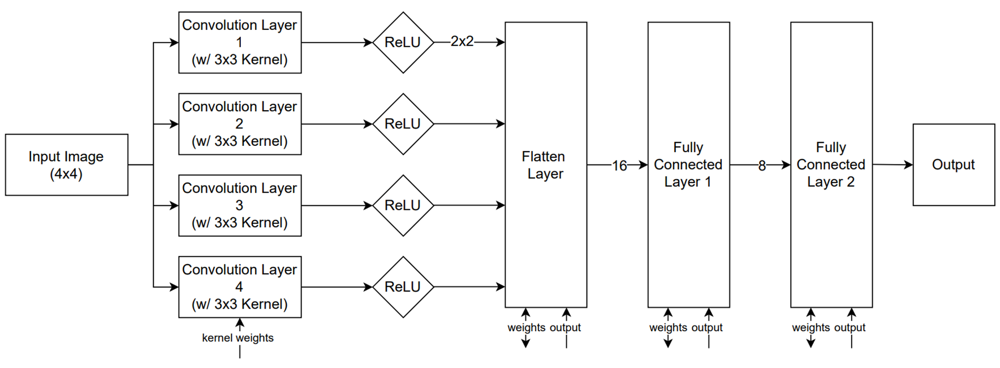

## Introduction

This project implements a Convolutional Neural Network (CNN) accelerator in System Verilog. View the [PowerPoint](FinalPresentation.pdf) for a quick summary. See the [OpenROAD](#openroad-results) and [Vivado](#vivado-fpga-results) results sections for a full analysis.

|  |
|:--:|
| *System Architecture* |

---
## Project Highlights
- **Utilized Physical Design Software**
  - Synopsis Design Compiler for preliminary area metrics
  - OpenROAD for PNR, clock tree, and PPA metrics
  - Vivado and ModelSim for simulation

- **Custom RTL CNN Architecture**
  - Includes 4 parallel 3×3 convolution filters
  - ReLU activation stage
  - Flattening layer
  - Fully connected layers with full 8-neuron FC1 and scalar FC2

- **Loop Unrolling and Acceleration**
  - Kernel flattening loop unrolled
  - Parallel processing via MAC units

- **Parameterizable and Modular Design**
  - Modular convolution, activation, FC, and backpropagation blocks
  - External weight/bias management for flexible training and inference

- **Training Support in RTL**
  - Implements mean squared error (MSE) loss
  - Gradient calculation and backpropagation for both FC1 and FC2

- **Optimized MAC Unit**
  - Tree-structured reduction with pipelined accumulation
  - Parameterized for scalable depth (`MAC_DEPTH`)

---

## Simulation Verification
This system is a simple neural network which prevents if an image is all black or all white. As such, the testbench consists of repeated injections of both classes. Shown below are the ModelSim waveforms and simulation outputs confirming that error is minimized after ~20 epochs. Note that the absolute value of the error decreases until this point in the waveform.

|  |
|:--:|
| *ModelSim Waveform* |

|  |
|:--:|
| *Text Output from ModelSim* |

---

## Project Directory Structure
- **Modular**
  - Unoptimized, first draft of code
  - Includes .sv and .v (from sv2v) versions
- **Modular_Optimized**
  - Includes optimizations from iterations A and B (see slides)
  - Includes .sv and .v (from sv2v) versions
- **OpenROAD_Files**
  - [constraint.sdc](OpenROAD_Files/constraint.sdc): defines 10 MHz clock and other elements used by OpenROAD
  - [unoptimized_TCL_reports.txt](OpenROAD_Files/unoptimized_TCL_reports.txt): PPA for base code
  - [optimized_TCL_reports.txt](OpenROAD_Files/optimized_TCL_reports.txt): PPA for phase A optimizations
  - [second_optimized_TCL_reports.txt](OpenROAD_Files/second_optimized_TCL_reports.txt): PPA for phase A and B optimizations
  - [proc.ys](OpenROAD_Files/proc.ys): Yosys script used to prepare Verilog file for OpenROAD processing. Removes all processes and fills in cells from the technology library.
  - [top_yosys_optimized.v](OpenROAD_Files/top_yosys_optimized.v): Incredibly long Verilog code used by OpenROAD and generated by proc.ys
- **Modular_Power/Modular_Optimized_Power**
  - Regular and optimized versions of the code converted to run with Vivado
  - Inputs and outputs have been drastically reduced to fit on FPGA
  - Used for realistic power reports

---

## OpenROAD Results

The above figure contains PPA and timing results from OpenROAD. Key findings are summarized below.
- The timing column refers to the total time to process the testbench (40 inputs)
- TNS and WNS are improved for the final design, but timing is not closed
- Power saw a slight increase, while area saw a very large increase
- However, performance saw the biggest gains by far, improving to 5 times faster
- The power estimate is unreasonable, which is why I also tested using Vivado

---

## Vivado FPGA Results

|  |
|:--:|
| *Unoptimized Vivado Power and Area Metrics* |

|  |
|:--:|
| *Optimized Vivado Power and Area Metrics* |

To get some more reasonable power usage results, we can instead implement the system on an FPGA. We can then use these results to determine if the parallel processing used by the optimized version is worthwhile in terms of PPA.

- Vivado produces much more reasonable power estimates
- We see 1.42 times higher power usage by the optimized version
- The unoptimized version uses more LUT, but less DSP.
- From these results, the 5 times speed factor still dominates power and area increases
- The images below show the implemented logic on an FPGA

|  |
|:--:|
| *Unoptimized Vivado FPGA Layout* |

|  |
|:--:|
| *Optimized Vivado FPGA Layout* |

---

## Future Optimizations

- Resolve timing issues using OpenROAD flow scripts
- Implement clock gating and resource reuse for further PPA gains
- Improved architecture for lower power usage
- Further utilize OpenROAD timing, clock tree, and layout features

---

## Resources

- https://github.com/The-OpenROAD-Project/OpenROAD-flow-scripts/blob/master/docs/tutorials/FlowTutorial.md
- https://github.com/zachjs/sv2v